# Layered Dependency Graph

- Source roots: `Littlewood.Main.LittlewoodPsi`, `Littlewood.Main.LittlewoodPi`
- Computed closure: 48 modules, 97 import edges
- Layering metric: shortest import distance from either root

```mermaid
graph TD
  subgraph D0["Depth 0"]
    Littlewood_Main_LittlewoodPi["Littlewood.Main.LittlewoodPi"]
    Littlewood_Main_LittlewoodPsi["Littlewood.Main.LittlewoodPsi"]
  end
  subgraph D1["Depth 1"]
    Littlewood_Aristotle_DeepSorries["Littlewood.Aristotle.DeepSorries"]
    Littlewood_Basic_OmegaNotation["Littlewood.Basic.OmegaNotation"]
    Littlewood_CoreLemmas_DirichletApproximation["Littlewood.CoreLemmas.DirichletApproximation"]
    Littlewood_CoreLemmas_GrowthDomination["Littlewood.CoreLemmas.GrowthDomination"]
    Littlewood_CoreLemmas_WeightedAverageFormula["Littlewood.CoreLemmas.WeightedAverageFormula"]
    Littlewood_CriticalAssumptions["Littlewood.CriticalAssumptions"]
    Littlewood_Oscillation_SchmidtTheorem["Littlewood.Oscillation.SchmidtTheorem"]
  end
  subgraph D2["Depth 2"]
    Littlewood_Aristotle_LandauSchmidtDirect["Littlewood.Aristotle.LandauSchmidtDirect"]
    Littlewood_Aristotle_RHCaseOscillation["Littlewood.Aristotle.RHCaseOscillation"]
    Littlewood_Basic_ChebyshevFunctions["Littlewood.Basic.ChebyshevFunctions"]
    Littlewood_Basic_LogarithmicIntegral["Littlewood.Basic.LogarithmicIntegral"]
    Littlewood_Bridge_ExplicitFormulaOscillation["Littlewood.Bridge.ExplicitFormulaOscillation"]
    Littlewood_Bridge_HardyChainHyp["Littlewood.Bridge.HardyChainHyp"]
    Littlewood_Bridge_HardyCriticalLineZerosDirect["Littlewood.Bridge.HardyCriticalLineZerosDirect"]
    Littlewood_Bridge_LandauOscillation["Littlewood.Bridge.LandauOscillation"]
    Littlewood_Bridge_OmegaThetaToPiLiWiring["Littlewood.Bridge.OmegaThetaToPiLiWiring"]
    Littlewood_Bridge_PhragmenLindelofWiring["Littlewood.Bridge.PhragmenLindelofWiring"]
    Littlewood_Bridge_PiLiDirectOscillation["Littlewood.Bridge.PiLiDirectOscillation"]
    Littlewood_Bridge_PsiOscillationWiring["Littlewood.Bridge.PsiOscillationWiring"]
    Littlewood_Bridge_PsiToPiLiOscillation["Littlewood.Bridge.PsiToPiLiOscillation"]
    Littlewood_Bridge_ThetaExplicitFormulaOscillation["Littlewood.Bridge.ThetaExplicitFormulaOscillation"]
    Littlewood_CoreLemmas_LandauLemma["Littlewood.CoreLemmas.LandauLemma"]
    Littlewood_ExplicitFormulas_ConversionFormulas["Littlewood.ExplicitFormulas.ConversionFormulas"]
    Littlewood_ZetaZeros_SupremumRealPart["Littlewood.ZetaZeros.SupremumRealPart"]
    Littlewood_ZetaZeros_ZeroCountingFunction["Littlewood.ZetaZeros.ZeroCountingFunction"]
    Littlewood_ZetaZeros_ZeroDensity["Littlewood.ZetaZeros.ZeroDensity"]
  end
  subgraph D3["Depth 3"]
    Littlewood_Aristotle_DirichletPhaseAlignment["Littlewood.Aristotle.DirichletPhaseAlignment"]
    Littlewood_Aristotle_HalfPlaneConnected["Littlewood.Aristotle.HalfPlaneConnected"]
    Littlewood_Aristotle_HardyEstimatesPartial["Littlewood.Aristotle.HardyEstimatesPartial"]
    Littlewood_Aristotle_LandauLittlewood["Littlewood.Aristotle.LandauLittlewood"]
    Littlewood_Aristotle_PhragmenLindelof["Littlewood.Aristotle.PhragmenLindelof"]
    Littlewood_Aristotle_PsiThetaCanonicalBound["Littlewood.Aristotle.PsiThetaCanonicalBound"]
    Littlewood_Aristotle_RemainderTermAnalysis["Littlewood.Aristotle.RemainderTermAnalysis"]
    Littlewood_Aristotle_ThetaToPiLiTransferInfra["Littlewood.Aristotle.ThetaToPiLiTransferInfra"]
    Littlewood_Aristotle_ZetaLogDerivNonAnalytic["Littlewood.Aristotle.ZetaLogDerivNonAnalytic"]
    Littlewood_ExplicitFormulas_ExplicitFormulaPsi["Littlewood.ExplicitFormulas.ExplicitFormulaPsi"]
  end
  subgraph D4["Depth 4"]
    Littlewood_Aristotle_Bridge_GammaGrowthComplete["Littlewood.Aristotle.Bridge.GammaGrowthComplete"]
    Littlewood_Aristotle_LandauContradiction["Littlewood.Aristotle.LandauContradiction"]
    Littlewood_Aristotle_PhragmenLindelofV2["Littlewood.Aristotle.PhragmenLindelofV2"]
    Littlewood_Aristotle_PsiThetaBound["Littlewood.Aristotle.PsiThetaBound"]
    Littlewood_Aristotle_ZetaLogDerivPole["Littlewood.Aristotle.ZetaLogDerivPole"]
  end
  subgraph D5["Depth 5"]
    Littlewood_Aristotle_Bridge_GammaGrowthWiring["Littlewood.Aristotle.Bridge.GammaGrowthWiring"]
    Littlewood_Aristotle_Bridge_StirlingRatioPL["Littlewood.Aristotle.Bridge.StirlingRatioPL"]
    Littlewood_Aristotle_GammaGrowthBoundsV2["Littlewood.Aristotle.GammaGrowthBoundsV2"]
    Littlewood_Aristotle_GammaGrowthGeneral["Littlewood.Aristotle.GammaGrowthGeneral"]
    Littlewood_Aristotle_SmoothedExplicitFormula["Littlewood.Aristotle.SmoothedExplicitFormula"]
  end
  Littlewood_Aristotle_Bridge_GammaGrowthComplete --> Littlewood_Aristotle_Bridge_GammaGrowthWiring
  Littlewood_Aristotle_Bridge_GammaGrowthComplete --> Littlewood_Aristotle_Bridge_StirlingRatioPL
  Littlewood_Aristotle_Bridge_GammaGrowthComplete --> Littlewood_Aristotle_GammaGrowthBoundsV2
  Littlewood_Aristotle_Bridge_GammaGrowthComplete --> Littlewood_Aristotle_GammaGrowthGeneral
  Littlewood_Aristotle_Bridge_GammaGrowthWiring --> Littlewood_Aristotle_GammaGrowthBoundsV2
  Littlewood_Aristotle_Bridge_StirlingRatioPL --> Littlewood_Aristotle_GammaGrowthGeneral
  Littlewood_Aristotle_DeepSorries --> Littlewood_Aristotle_LandauSchmidtDirect
  Littlewood_Aristotle_DeepSorries --> Littlewood_Aristotle_RHCaseOscillation
  Littlewood_Aristotle_DeepSorries --> Littlewood_CoreLemmas_GrowthDomination
  Littlewood_Aristotle_DeepSorries --> Littlewood_Oscillation_SchmidtTheorem
  Littlewood_Aristotle_DeepSorries --> Littlewood_ZetaZeros_ZeroCountingFunction
  Littlewood_Aristotle_LandauContradiction --> Littlewood_Aristotle_SmoothedExplicitFormula
  Littlewood_Aristotle_LandauContradiction --> Littlewood_Basic_ChebyshevFunctions
  Littlewood_Aristotle_LandauContradiction --> Littlewood_Basic_LogarithmicIntegral
  Littlewood_Aristotle_LandauContradiction --> Littlewood_ZetaZeros_ZeroCountingFunction
  Littlewood_Aristotle_LandauLittlewood --> Littlewood_Aristotle_LandauContradiction
  Littlewood_Aristotle_LandauLittlewood --> Littlewood_Oscillation_SchmidtTheorem
  Littlewood_Aristotle_LandauSchmidtDirect --> Littlewood_Aristotle_HalfPlaneConnected
  Littlewood_Aristotle_LandauSchmidtDirect --> Littlewood_Aristotle_ZetaLogDerivNonAnalytic
  Littlewood_Aristotle_LandauSchmidtDirect --> Littlewood_Basic_LogarithmicIntegral
  Littlewood_Aristotle_LandauSchmidtDirect --> Littlewood_Basic_OmegaNotation
  Littlewood_Aristotle_LandauSchmidtDirect --> Littlewood_CoreLemmas_GrowthDomination
  Littlewood_Aristotle_LandauSchmidtDirect --> Littlewood_ZetaZeros_SupremumRealPart
  Littlewood_Aristotle_LandauSchmidtDirect --> Littlewood_ZetaZeros_ZeroCountingFunction
  Littlewood_Aristotle_PhragmenLindelof --> Littlewood_Aristotle_Bridge_GammaGrowthComplete
  Littlewood_Aristotle_PhragmenLindelof --> Littlewood_Aristotle_PhragmenLindelofV2
  Littlewood_Aristotle_PsiThetaCanonicalBound --> Littlewood_Aristotle_PsiThetaBound
  Littlewood_Aristotle_PsiThetaCanonicalBound --> Littlewood_Basic_ChebyshevFunctions
  Littlewood_Aristotle_RHCaseOscillation --> Littlewood_Basic_ChebyshevFunctions
  Littlewood_Aristotle_RHCaseOscillation --> Littlewood_Basic_LogarithmicIntegral
  Littlewood_Aristotle_RHCaseOscillation --> Littlewood_Basic_OmegaNotation
  Littlewood_Aristotle_RHCaseOscillation --> Littlewood_CoreLemmas_GrowthDomination
  Littlewood_Aristotle_SmoothedExplicitFormula --> Littlewood_Aristotle_DeepSorries
  Littlewood_Aristotle_ThetaToPiLiTransferInfra --> Littlewood_Basic_ChebyshevFunctions
  Littlewood_Aristotle_ThetaToPiLiTransferInfra --> Littlewood_Basic_LogarithmicIntegral
  Littlewood_Aristotle_ThetaToPiLiTransferInfra --> Littlewood_Basic_OmegaNotation
  Littlewood_Aristotle_ZetaLogDerivNonAnalytic --> Littlewood_Aristotle_ZetaLogDerivPole
  Littlewood_Aristotle_ZetaLogDerivNonAnalytic --> Littlewood_ZetaZeros_ZeroCountingFunction
  Littlewood_Bridge_ExplicitFormulaOscillation --> Littlewood_Aristotle_DirichletPhaseAlignment
  Littlewood_Bridge_ExplicitFormulaOscillation --> Littlewood_Oscillation_SchmidtTheorem
  Littlewood_Bridge_HardyChainHyp --> Littlewood_Aristotle_HardyEstimatesPartial
  Littlewood_Bridge_HardyCriticalLineZerosDirect --> Littlewood_Aristotle_DeepSorries
  Littlewood_Bridge_LandauOscillation --> Littlewood_Aristotle_LandauLittlewood
  Littlewood_Bridge_LandauOscillation --> Littlewood_Oscillation_SchmidtTheorem
  Littlewood_Bridge_OmegaThetaToPiLiWiring --> Littlewood_Aristotle_PsiThetaCanonicalBound
  Littlewood_Bridge_OmegaThetaToPiLiWiring --> Littlewood_Aristotle_RemainderTermAnalysis
  Littlewood_Bridge_OmegaThetaToPiLiWiring --> Littlewood_Aristotle_ThetaToPiLiTransferInfra
  Littlewood_Bridge_OmegaThetaToPiLiWiring --> Littlewood_ExplicitFormulas_ConversionFormulas
  Littlewood_Bridge_PhragmenLindelofWiring --> Littlewood_Aristotle_PhragmenLindelof
  Littlewood_Bridge_PhragmenLindelofWiring --> Littlewood_Bridge_HardyChainHyp
  Littlewood_Bridge_PiLiDirectOscillation --> Littlewood_Aristotle_DirichletPhaseAlignment
  Littlewood_Bridge_PiLiDirectOscillation --> Littlewood_Oscillation_SchmidtTheorem
  Littlewood_Bridge_PsiOscillationWiring --> Littlewood_Oscillation_SchmidtTheorem
  Littlewood_Bridge_PsiToPiLiOscillation --> Littlewood_ExplicitFormulas_ConversionFormulas
  Littlewood_Bridge_PsiToPiLiOscillation --> Littlewood_Oscillation_SchmidtTheorem
  Littlewood_Bridge_ThetaExplicitFormulaOscillation --> Littlewood_Oscillation_SchmidtTheorem
  Littlewood_CoreLemmas_DirichletApproximation --> Littlewood_ZetaZeros_ZeroCountingFunction
  Littlewood_CoreLemmas_WeightedAverageFormula --> Littlewood_Basic_ChebyshevFunctions
  Littlewood_CoreLemmas_WeightedAverageFormula --> Littlewood_CoreLemmas_DirichletApproximation
  Littlewood_CoreLemmas_WeightedAverageFormula --> Littlewood_ZetaZeros_ZeroDensity
  Littlewood_CriticalAssumptions --> Littlewood_Bridge_ExplicitFormulaOscillation
  Littlewood_CriticalAssumptions --> Littlewood_Bridge_HardyChainHyp
  Littlewood_CriticalAssumptions --> Littlewood_Bridge_HardyCriticalLineZerosDirect
  Littlewood_CriticalAssumptions --> Littlewood_Bridge_LandauOscillation
  Littlewood_CriticalAssumptions --> Littlewood_Bridge_OmegaThetaToPiLiWiring
  Littlewood_CriticalAssumptions --> Littlewood_Bridge_PhragmenLindelofWiring
  Littlewood_CriticalAssumptions --> Littlewood_Bridge_PiLiDirectOscillation
  Littlewood_CriticalAssumptions --> Littlewood_Bridge_PsiOscillationWiring
  Littlewood_CriticalAssumptions --> Littlewood_Bridge_PsiToPiLiOscillation
  Littlewood_CriticalAssumptions --> Littlewood_Bridge_ThetaExplicitFormulaOscillation
  Littlewood_CriticalAssumptions --> Littlewood_ExplicitFormulas_ConversionFormulas
  Littlewood_ExplicitFormulas_ConversionFormulas --> Littlewood_Basic_ChebyshevFunctions
  Littlewood_ExplicitFormulas_ConversionFormulas --> Littlewood_Basic_LogarithmicIntegral
  Littlewood_ExplicitFormulas_ConversionFormulas --> Littlewood_Basic_OmegaNotation
  Littlewood_ExplicitFormulas_ConversionFormulas --> Littlewood_ZetaZeros_ZeroCountingFunction
  Littlewood_ExplicitFormulas_ExplicitFormulaPsi --> Littlewood_Basic_ChebyshevFunctions
  Littlewood_ExplicitFormulas_ExplicitFormulaPsi --> Littlewood_ZetaZeros_ZeroDensity
  Littlewood_Main_LittlewoodPi --> Littlewood_Aristotle_DeepSorries
  Littlewood_Main_LittlewoodPi --> Littlewood_CoreLemmas_GrowthDomination
  Littlewood_Main_LittlewoodPi --> Littlewood_Main_LittlewoodPsi
  Littlewood_Main_LittlewoodPi --> Littlewood_Oscillation_SchmidtTheorem
  Littlewood_Main_LittlewoodPsi --> Littlewood_Aristotle_DeepSorries
  Littlewood_Main_LittlewoodPsi --> Littlewood_Basic_OmegaNotation
  Littlewood_Main_LittlewoodPsi --> Littlewood_CoreLemmas_DirichletApproximation
  Littlewood_Main_LittlewoodPsi --> Littlewood_CoreLemmas_GrowthDomination
  Littlewood_Main_LittlewoodPsi --> Littlewood_CoreLemmas_WeightedAverageFormula
  Littlewood_Main_LittlewoodPsi --> Littlewood_CriticalAssumptions
  Littlewood_Main_LittlewoodPsi --> Littlewood_Oscillation_SchmidtTheorem
  Littlewood_Oscillation_SchmidtTheorem --> Littlewood_Basic_ChebyshevFunctions
  Littlewood_Oscillation_SchmidtTheorem --> Littlewood_Basic_LogarithmicIntegral
  Littlewood_Oscillation_SchmidtTheorem --> Littlewood_Basic_OmegaNotation
  Littlewood_Oscillation_SchmidtTheorem --> Littlewood_CoreLemmas_LandauLemma
  Littlewood_Oscillation_SchmidtTheorem --> Littlewood_ZetaZeros_SupremumRealPart
  Littlewood_ZetaZeros_SupremumRealPart --> Littlewood_Basic_ChebyshevFunctions
  Littlewood_ZetaZeros_SupremumRealPart --> Littlewood_ExplicitFormulas_ExplicitFormulaPsi
  Littlewood_ZetaZeros_SupremumRealPart --> Littlewood_ZetaZeros_ZeroCountingFunction
  Littlewood_ZetaZeros_ZeroDensity --> Littlewood_ZetaZeros_ZeroCountingFunction
```

