# Main-Chain State Graph (Checkpoint `cc9e2bf`)

This graph shows the complete active main-chain route from exported theorems in `Littlewood/Main/*` to all currently blocked frontier nodes.

Legend:
- Green = wired/resolved route node.
- Amber = assumption or constructor not synthesized.
- Red = concrete blocker (delegated `sorry` theorem body).

```mermaid
flowchart TD
  %% =====================
  %% Main exports
  %% =====================
  M0[Littlewood.Main.Littlewood]
  MPsi[Littlewood.Main.LittlewoodPsi.littlewood_psi]
  MPi[Littlewood.Main.LittlewoodPi.littlewood_pi_li]

  M0 --> MPsi
  M0 --> MPi

  MPsi --> Dpsi[Aristotle.DeepSorries.psi_full_strength_oscillation]
  MPi --> Dpi[Aristotle.DeepSorries.pi_li_full_strength_oscillation]

  Dpsi --> Dall[Aristotle.DeepSorries.all_deep_results]
  Dpi --> Dall
  Dall --> Dcomb[Aristotle.DeepSorries.combined_atoms]
  Dcomb --> Dres[Aristotle.Standalone.DeepBlockersResolved.combined_atoms_resolved_unconditional]

  %% =====================
  %% DeepBlockersResolved assembly
  %% =====================
  Dres --> Aall[DeepBlockersResolved.all_deep_blockers]

  Aall --> B1[deep_blocker_B1]
  Aall --> B2[deep_blocker_B2]
  Aall --> B3[deep_blocker_B3]
  Aall --> B5[deep_blocker_B5]
  Aall --> B6[deep_blocker_B6]
  Aall --> B7[deep_blocker_B7_coeff_control_leaf]

  %% B1
  B1 --> HMZ[HardyMeanSquareAsymptoticFromZetaMoment.hardyMeanSquareAsymptoticHyp_proved]
  HMZ --> HAA[HardyAfeSignedGapAtomic.afe_signed_integral_gap_bound_atomic]
  HAA --> HLeaf[HardyAfeSignedGapDeepLeaf.afe_signed_integral_gap_bound_leaf]

  %% B2
  B2 --> BW[ B2StationaryWindowLeaves.mainTermFirstMomentBoundHyp_from_windowLeaves ]
  BW --> BTLeaf[B2TailVdcDeepLeaf.tailVdcSqrtModeClass_leaf]

  %% B3 / RS7
  B3 --> RSComp[RSCompleteBlockAsymptotic.rsCompleteBlockWithResidual_sorry]
  RSComp --> RSBlk[RSBlockBounds.rs_block_analysis_proof]
  RSBlk --> RSN[c_block_nonneg]
  RSBlk --> RSA[c_block_antitone]
  RSBlk --> RSI[block_interpolation]
  RSBlk --> ETh[ErrorTermExpansion.theta_stirling_expansion]
  RSBlk --> EInt[ErrorTermExpansion.off_resonance_integral_bound]
  RSBlk --> ESum[ErrorTermExpansion.off_resonance_sum_bound]
  RSBlk --> EExp[ErrorTermExpansion.errorTerm_expansion]

  %% B5a/B5b
  B5 --> B5a[deep_blocker_B5a]
  B5 --> B5b[deep_blocker_B5b]

  B5a --> EPSkel[ExplicitFormulaPsiSkeleton.explicitFormulaPsiGeneral_proved]
  EPSkel --> EPComp[ExplicitFormulaPsiB5aComponents.shifted_contours_components_atomic]
  EPComp --> EPAtomic[ExplicitFormulaPsiB5aShiftedBoundAtomic.shifted_remainder_bound_atomic]
  EPAtomic --> EPLeaf[ExplicitFormulaPsiB5aShiftedBoundDeepLeaf.shifted_remainder_bound_leaf]

  B5b --> CZD[CriticalZeroSumDivergesHyp]
  B5b --> PAT[PhaseAlignmentToTargetHyp]

  %% B7
  B7 --> RH1[truncatedExplicitFormulaPi_unconditional]
  B7 --> RH2[targetTowerExactSeedAbovePerronThreshold_unconditional]
  B7 --> RH3[antiTargetTowerExactSeedAbovePerronThreshold_unconditional]

  %% Constructor frontier (root synthesis)
  RF[Root Constructor Frontier] --> R1[ZetaMeanSquareHalfBound]
  RF --> R2[B2TailVdcRootPayload]
  RF --> R3[B2VdcFirstDerivTailRootPayload]
  RF --> R4[B2SupportPhaseRootPayload]
  RF --> R5[ExplicitFormulaPsiHyp]
  RF --> R6[ExplicitFormulaPsiGeneralHyp]
  RF --> R7[RHPiUnconditionalExactSeedRootPayload]

  R1 -.blocks.-> HAA
  R2 -.blocks.-> BTLeaf
  R3 -.upstream blocks.-> BTLeaf
  R4 -.upstream blocks.-> BTLeaf
  R5 -.alt provider blocks.-> EPLeaf
  R6 -.provider blocks.-> EPLeaf
  R7 -.provider blocks.-> RH1

  %% styles
  classDef blocked fill:#ffdddd,stroke:#b30000,stroke-width:2px,color:#111;
  classDef assumption fill:#fff2cc,stroke:#b36b00,stroke-width:2px,color:#111;
  classDef resolved fill:#ddffdd,stroke:#0b6b0b,stroke-width:1.5px,color:#111;

  class HLeaf,BTLeaf,RSN,RSA,RSI,ETh,EInt,ESum,EExp,EPLeaf,RH1,RH2,RH3 blocked;
  class CZD,PAT,R1,R2,R3,R4,R5,R6,R7 assumption;
  class M0,MPsi,MPi,Dpsi,Dpi,Dall,Dcomb,Dres,Aall,B1,B2,B3,B5,B6,B7,HMZ,HAA,BW,RSComp,RSBlk,B5a,B5b,EPSkel,EPComp,EPAtomic resolved;
```

## Snapshot Counts
- `main_sorries=0`
- `delegated_sorries=13`
- `delegated_axiom_postulate_lines=0`
- Unsynthesized root constructors: 15
- Unsynthesized main-chain assumptions: 2
