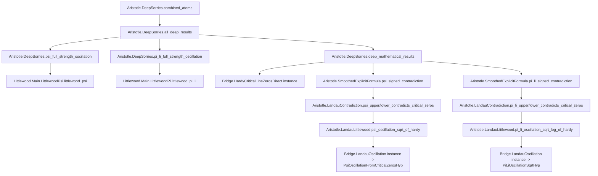

# Theorem State Graph

This graph tracks how the main theorem statements in `Main/*` are obtained from `DeepSorries` and how bridge-level contradictions/projected results are connected.

```mermaid
graph TD
  CA["Aristotle.DeepSorries.combined_atoms"]
  ADR["Aristotle.DeepSorries.all_deep_results"]
  DMR["Aristotle.DeepSorries.deep_mathematical_results"]
  PFS["Aristotle.DeepSorries.psi_full_strength_oscillation"]
  PiFS["Aristotle.DeepSorries.pi_li_full_strength_oscillation"]

  MPSI["Littlewood.Main.LittlewoodPsi.littlewood_psi"]
  MPI["Littlewood.Main.LittlewoodPi.littlewood_pi_li"]

  HINST["Bridge.HardyCriticalLineZerosDirect.instance"]
  SPSC["Aristotle.SmoothedExplicitFormula.psi_signed_contradiction"]
  SPIC["Aristotle.SmoothedExplicitFormula.pi_li_signed_contradiction"]

  LCPSI["Aristotle.LandauContradiction.psi_upper/lower_contradicts_critical_zeros"]
  LCPI["Aristotle.LandauContradiction.pi_li_upper/lower_contradicts_critical_zeros"]
  LLPSI["Aristotle.LandauLittlewood.psi_oscillation_sqrt_of_hardy"]
  LLPI["Aristotle.LandauLittlewood.pi_li_oscillation_sqrt_log_of_hardy"]
  LOSP["Bridge.LandauOscillation instance -> PsiOscillationFromCriticalZerosHyp"]
  LOSPI["Bridge.LandauOscillation instance -> PiLiOscillationSqrtHyp"]

  CA --> ADR
  ADR --> DMR
  ADR --> PFS
  ADR --> PiFS
  PFS --> MPSI
  PiFS --> MPI

  DMR --> HINST
  DMR --> SPSC
  DMR --> SPIC
  SPSC --> LCPSI
  SPIC --> LCPI
  LCPSI --> LLPSI
  LCPI --> LLPI
  LLPSI --> LOSP
  LLPI --> LOSPI
```
